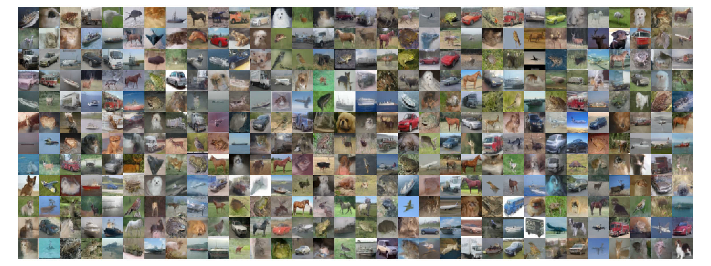

# Consistency flow matching

[](http://www.repostatus.org/#concept)
[](https://github.com/dirmeier/consistency-flow-matching/actions/workflows/ci.yaml)

> Flow-matching, consistency-matching, and consistency-flow-matching implementations in Flax

## About

This repository implements

- Rectified flow matching (from [Flow Straight and Fast: Learning to Generate and Transfer Data with Rectified Flow](https://arxiv.org/abs/2209.03003)),
- Consistency matching (from [Consistency models](https://arxiv.org/abs/2303.01469)),
- Consistency flow matching (from [Consistency Flow Matching: Defining Straight Flows with Velocity Consistency](https://arxiv.org/abs/2407.02398)),
- Elucidated denoising diffusion (from [Elucidating the Design Space of Diffusion-Based Generative Models](https://arxiv.org/abs/2206.00364))

using JAX and Flax. The methods are mainly implemented to compare consistency flow matching
with the other three approaches, so there is only some limited functionality. As score network architectures (or vector fields), we provide implementations of the U-Net
used in [DDPM++](https://arxiv.org/abs/2011.13456) and the [diffusion transformer](https://arxiv.org/abs/2212.09748).

## Example usage

The `experiments` folder contains example code that can be used to train one of the generative models on CIFAR10.
Depending on what method you want to use, call:

```bash
cd experiments/cifar10
python main.py
  --config=config.py
  --config.model=<denoising_diffusion|flow_matching|consistency_matching|consistency_flow_matching>
  --config.score_net=<unet|dit>
  --workdir=<dir>
  (--usewand)
```

I compared samples from a consistency flow matcher (CFM) to those of a rectified flow matcher (RFM) and a elucidated diffusion model (EDM).
As a baseline, the EDM uses a Heun solver using 25 steps (i.e., 50 function evaluations (FEs)).
The RFM uses an Euler solver with 25 steps (which is technically not necessary since the trajectories are linear).
The CFM uses an Euler solver with 10 steps (which is fair since it is the entire point of using consistency matching).

I tested various parameterizations for all three models (including the ones described in the original publications).
In the end, I trained all models for

- 500 000 steps using an Adam optimizer with 1000 linear steps of warmup and a cosine decay schedule,
- batch size of 512,
- a U-Net with 128 base channels, and which uses attention at a resolution of 16 and [1, 2, 2, 2] channel multipliers.
- EMA decay rates of 0.999 and 0.999999 (as in the CFM paper).

Some observations:

- Both the EDM and RFM generate high-quality samples after as few as 50k training steps.
- The EDM and RFM are extremely robust to different parameterizations.
- No matter the parameterization of the CFM (including the EMA decay rate) I **cannot reproduce the results of the paper**.
  The parameterization is either very fragile or I have a bug (if you find one [here](cfm/consistency_flow_matching.py), please report it).
- The CFM, at least in my experiments, does not converge faster than EDM/RFM (which is one of the claims of the paper).

Below are some samples from a trained RFM after 100 000 steps. The samples if an EDM have visually the same quality:

<div align="center">
  
</div>

## Installation

To install the latest GitHub <RELEASE>, just call the following on the command line:

```bash
pip install git+https://github.com/dirmeier/consistency-flow-matching@<RELEASE>
```

You can also download the latest <RELEASE> and install using `rye`
```shell
rye sync
```

## Author

Simon Dirmeier <a href="mailto:sfyrbnd @ pm me">sfyrbnd @ pm me</a>
